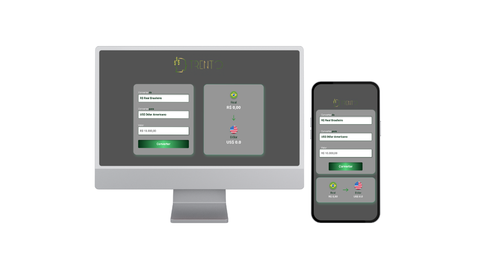

## CONVERSOR DE MOEDAS
 

## PRATICANDO HTML5, CSS, JAVASCRIPT.

Este é um projeto que desenvolvi com os conhecimentos adquiridos no DevClub!

# Mergulhando no universo do JavaScript.

Usei toda minha criatividade na criação e estilização da página, tornando a interação mais intuitiva. Além disso, aprofundei meus conhecimentos em JavaScript, aplicando-os para garantir a funcionalidade do site.

 

<b>Tecnologias utilizadas para o desenvolvimento do site:</b>

 
  
  
  

 

 
<b>Minhas redes:</b> 
 

